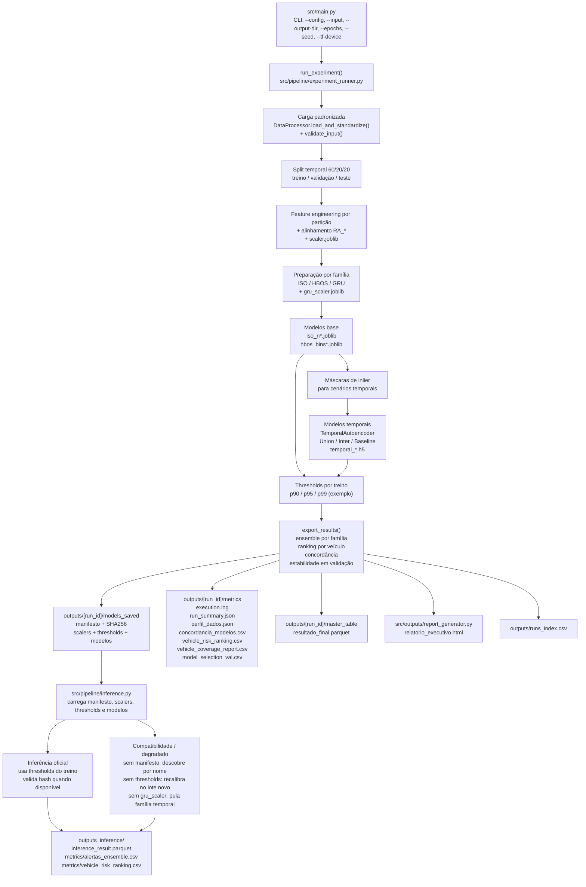

# Ensemble_SSP-DF

## Objetivo
Este repositório implementa um pipeline de detecção de anomalias veiculares para apoio analítico e operacional da SSP-DF.

O sistema combina três famílias de modelos:
- Isolation Forest: detecção tabular global.
- HBOS: detecção tabular por histogramas univariados.
- GRU Autoencoder: detecção temporal por sequência (com LSTM como fallback configurável).

A decisão final é realizada por ensemble por família (ISO, HBOS e Temporal), com rastreabilidade por `run_id`, manifesto de artefatos e hash de integridade.

Nota de codificação: este arquivo deve permanecer em UTF-8. Se algum terminal exibir texto corrompido (mojibake), ajuste o encoding da sessão para UTF-8 antes de visualizar o README.

## Fluxo do Pipeline
O treinamento completo (`python -m src.main`) executa 5 etapas:
1. Ingestão e validação de schema.
2. Feature engineering por partição temporal (treino/val/test), com alinhamento de colunas sem leakage.
3. Treino dos modelos base (ISO + HBOS).
4. Treino dos modelos temporais (GRU) nos cenários Union/Inter/Baseline.
5. Exportação de artefatos: thresholds, manifesto, parquet final e relatório HTML.

## Descrição Técnica e Resultados Esperados
Esta POC foi desenhada para apoiar triagem analítica de deslocamentos veiculares a partir de telemetria GPS, com ênfase em:
- detecção não supervisionada de padrões atípicos no nível de registro;
- agregação de risco por veículo para priorização operacional;
- reprodutibilidade por `run_id`, metadados git e serialização explícita de thresholds;
- rastreabilidade de artefatos por `models_manifest.json` com SHA256.

Resultados esperados de uma execução saudável:
- criação de uma run versionada em `outputs/<run_id>/`;
- geração de `models_manifest.json` e thresholds por percentil configurado em `parametros.percentis_teste`;
- exportação de `resultado_final.parquet` com scores, labels e `ensemble_alert`;
- geração de `relatorio_executivo.html` com KPIs, ranking por veículo, cobertura temporal e limitações metodológicas;
- possibilidade de reuso dos mesmos artefatos em `src.pipeline.inference` sem re-treino.

Resultados que o projeto não promete, por desenho:
- `precision`, `recall` ou `F1` reais sem base rotulada;
- comprovação de irregularidade operacional;
- cobertura temporal de 100% para todos os veículos.

### 2.1 Cenários Temporais (Union, Inter, Baseline)
No fluxo real de `src/pipeline/experiment_runner.py` (`train_temporal_models()`), o treino temporal é executado em três modalidades:
- `Union`: usa máscara `ISO_inlier OR HBOS_inlier` na posição final de cada sequência, sempre restrita ao período de treino estrito.
- `Inter`: usa máscara `ISO_inlier AND HBOS_inlier`, também restrita ao treino estrito.
- `Baseline`: usa somente a máscara de treino estrito por sequência (sem filtro de qualidade tabular por ISO/HBOS).

Detalhes operacionais importantes:
- O filtro temporal é anti-leakage: a sequência só entra no treino se início e fim estiverem antes do corte treino/validação.
- `Union` e `Inter` são treinados para cada combinação de variantes ISO x HBOS; o `Baseline` é treinado uma única vez.
- Os artefatos temporais são exportados em `models_saved/` como `temporal_union_*.h5`, `temporal_inter_*.h5` e `temporal_baseline.h5`, com nomes canônicos no manifesto (`Temporal_Union_*`, `Temporal_Inter_*`, `Temporal_Baseline`).

### 2.2 Critério de Seleção e Leitura de `model_selection_val.csv`
O arquivo `model_selection_val.csv` é produzido em `export_results()` usando `compute_val_stability_metrics()` (`src/utils/model_selection.py`), com as seguintes regras:
- referência: distribuição de `df_train` (somente treino);
- comparação: distribuição de `df_val` (somente validação);
- métrica principal: `stability_delta_pct = |taxa_anomalia_treino - taxa_anomalia_val|` no percentil operacional;
- ordenação: menor `stability_delta_pct` recebe melhor `rank_stability`.

Escopo real desse artefato:
- ele ranqueia **colunas de score ISO/HBOS** (`score_cols_for_selection` filtra apenas prefixos `ISO` e `HBOS`);
- ele **não faz seleção automática** de `Union` vs `Inter` vs `Baseline`;
- no estado atual, todos os cenários temporais treinados permanecem ativos e entram na decisão por família no ensemble.

Leitura recomendada para desenvolvedor:
- usar `model_selection_val.csv` para identificar quais variantes tabulares ficaram mais estáveis entre treino e validação;
- cruzar esse ranking com os modelos temporais derivados da mesma combinação ISO/HBOS quando for necessário hardening operacional por política interna.

### 2.2.1 Atualização de Governança Operacional Temporal
Política operacional vigente:
- `parametros.temporal.temporal_strategy` aceita `all` (legado), `union`, `inter` ou `baseline`.
- `all` mantém comportamento analítico retrocompatível com todos os cenários temporais ativos.
- `union|inter|baseline` aplicam filtro operacional explícito antes da exportação final, removendo cenários temporais não eleitos.

Auditabilidade:
- `run_summary.json` inclui `temporal_strategy_configured`, `temporal_strategy_effective` e `temporal_strategy_selection_source`.
- `model_selection_val.csv` inclui colunas de contexto da política temporal.
- `temporal_strategy_selection_val.csv` resume estabilidade por estratégia temporal usando apenas treino/validação.

## Diagrama da Arquitetura Operacional
O diagrama abaixo cobre as sete camadas do sistema, da ingestão de dados brutos até a camada de auditoria, com variantes de modelo, contratos de artefato e modos de inferência.



### Camadas do Sistema
As 7 camadas representadas no diagrama são:
1. Entrada e orquestração: `src/main.py` resolve parâmetros de execução e aciona `run_experiment()`.
2. Ingestão e validação: carga padronizada com `DataProcessor.load_and_standardize()` e validação de schema.
3. Particionamento e preparação de features: split temporal (treino/validação/teste), feature engineering, alinhamento de colunas `RA_*` e ajuste do `scaler.joblib`.
4. Modelagem tabular base: treino de variantes ISO e HBOS, geração de scores e labels por percentil.
5. Modelagem temporal multi-cenário: treino `Union`, `Inter` e `Baseline` com `TemporalAutoencoder`, usando `gru_scaler.joblib`.
6. Exportação e governança de artefatos: thresholds (`thresholds_p<percentil>.json`), `models_manifest.json` com SHA256, parquet final, métricas e relatório.
7. Inferência operacional: `src/pipeline/inference.py` consome manifesto, schema de features, scalers e thresholds, aplica modelos e gera `ensemble_alert`.

### Decisões de Design
- Dois scalers separados (`scaler.joblib` e `gru_scaler.joblib`): ISO/HBOS operam em features tabulares; o temporal usa conjunto próprio com `latitude/longitude`, exigindo normalização independente para manter coerência numérica no pipeline.
- GRU como padrão e LSTM como fallback: o projeto usa `parametros.temporal.arch_type` e, no estado atual, opera com GRU por padrão; LSTM permanece como opção de compatibilidade para cenários específicos.
- Ensemble por família, não score único global: `compute_ensemble_decision()` calcula voto por família (ISO, HBOS, Temporal) com pesos equivalentes, reduzindo viés de famílias com mais variantes.
- SHA256 e rastreabilidade: `models_manifest.json` registra caminhos e hashes dos artefatos (incluindo thresholds e schema), além de metadados de versão/git; em inferência estrita, isso suporta validação de integridade e cadeia de auditoria exigida em contexto de órgão público.

## Modelos
| Família | Implementação | Escopo | Observação |
|---|---|---|---|
| ISO Forest | `sklearn.ensemble.IsolationForest` | Todos os registros | Usa `random_state` fixo para reprodutibilidade. |
| HBOS | `pyod.models.hbos.HBOS` | Todos os registros | Features independentes definidas em `config/feature_config.py`. |
| Temporal | `src.models.temporal_autoencoder.TemporalAutoencoder` | Registros com sequência válida | Padrão: GRU. LSTM é fallback configurável (`parametros.temporal.arch_type`). |

Dois scalers são usados por design:
- `scaler.joblib`: features tabulares de ISO/HBOS.
- `gru_scaler.joblib`: features temporais do GRU (inclui lat/lon).

## Requisitos de Software e Hardware
### Hardware mínimo (CPU)
| Item | Requisito | Fonte |
|---|---|---|
| CPU | [ESTIMAR] 4 vCPU | Não há benchmark formal versionado no repositório |
| RAM | [ESTIMAR] 8 GB | Não há benchmark formal versionado no repositório |
| GPU | Não obrigatória | `--tf-device cpu` (default funcional) |
| VRAM | Não aplicável no perfil CPU | — |
| Disco livre | [ESTIMAR] ~2 GB (ambiente + artefatos de uma run) | Estimativa operacional, sem medição formal no repositório |

### Hardware recomendado (GPU)
| Item | Requisito | Fonte |
|---|---|---|
| CPU | [ESTIMAR] 8+ vCPU | Recomendação operacional (sem benchmark formal versionado) |
| RAM | [ESTIMAR] 16-32 GB (conforme volume de dados) | Recomendação operacional (sem benchmark formal versionado) |
| GPU | NVIDIA compatível com TensorFlow 2.12.x | `requirements-gpu.txt`, `Dockerfile.gpu` |
| VRAM mínima | [ESTIMAR] 4 GB (para `batch_size=64`, `window_size=3`) | Não testado formalmente neste repositório |
| Disco livre | [ESTIMAR] ~5 GB (ambiente + imagem Docker + outputs) | Estimativa operacional; tamanho depende do host e da run |
| CUDA/cuDNN | [ESTIMAR] CUDA 11.8 / cuDNN 8.6 (base `tensorflow:2.12.0-gpu`) | Não há pin explícito de CUDA/cuDNN no repositório; derivado da imagem base |

### Software
| Componente | Versão / Faixa comprovada | Fonte |
|---|---|---|
| Python | `3.10` / `3.10.x` | `environment.yml`, `environment.gpu.yml`, `Dockerfile` (`python:3.10-slim`) |
| TensorFlow (CPU) | `tensorflow-cpu==2.12.0` | `requirements.txt`, `environment.yml` |
| TensorFlow (GPU) | `tensorflow==2.12.0` | `requirements-gpu.txt`, `environment.gpu.yml`, `Dockerfile.gpu` |
| Keras | `2.12.0` | `requirements*.txt`, `environment.gpu.yml` (pip) |
| NumPy | `1.23.5` | `requirements*.txt`, `environment*.yml` |
| scikit-learn | `>=1.3.0` | `requirements*.txt`, `environment*.yml` |
| pyod | `>=1.1.0` | `requirements*.txt`, `environment*.yml` (pip) |
| pandas | `>=1.5.0` | `requirements*.txt`, `environment*.yml` |
| pandera | `>=0.18.0,<0.19.0` | `requirements*.txt`, `environment*.yml` (pip) |
| plotly | `>=5.18.0` | `requirements*.txt`, `environment*.yml` (pip) |
| mlflow | `>=2.10.0` | `requirements*.txt`, `environment*.yml` (pip) |
| pyyaml | `>=6.0` | `requirements*.txt`, `environment*.yml` |
| joblib | `>=1.3.0` | `requirements*.txt`, `environment*.yml` |
| holidays | (sem pin) | `requirements*.txt`, `environment*.yml` — usado em `data_processor.py` para feriados BR/DF |
| pyarrow | `>=12.0.0` | `requirements*.txt`, `environment*.yml` |
| tqdm | `>=4.65.0` | `requirements*.txt`, `environment*.yml` |
| Docker Engine | [ESTIMAR] `>=20.10` (com suporte a Compose V2) | Não há versão mínima pinada em arquivo de dependência |
| Docker Compose | [ESTIMAR] `>=2.0` (plugin integrado ao Docker CLI) | Não há versão mínima pinada em arquivo de dependência |

Sistemas operacionais suportados:
- **Linux**: suportado (comandos Bash + fluxo Docker documentados).
- **Windows**: suportado (comandos PowerShell/CMD documentados, testado no desenvolvimento).
- **macOS**: [ESTIMAR] compatível em princípio (mesmos comandos Bash do Linux), sem validação formal neste projeto.

Observações operacionais:
- Para GPU em contêiner, o host deve ter driver NVIDIA e NVIDIA Container Toolkit.
- Em GPU, determinismo bit-a-bit pode variar por stack CUDA/cuDNN do ambiente.

### Governança de Dependências (Release Institucional)
Política adotada:
- `requirements.txt` e `environment.yml` usam faixas controladas (com teto de versão) para reduzir drift sem forçar upgrade grande de runtime.
- `tensorflow-cpu` e `keras` permanecem fixos em `2.12.0` nesta fase.

Processo de congelamento para release:
1. Criar ambiente limpo com os arquivos versionados (`requirements.txt` ou `environment.yml`).
2. Gerar lockfile institucional do release:
   - pip: `pip freeze > requirements.release.lock.txt`
   - conda: `conda env export --no-builds > environment.release.lock.yml`
3. Validar CI e treino/inferência com os lockfiles gerados.
4. Versionar os lockfiles junto com a tag de release institucional.

Regra de segurança no CI:
- O workflow usa `pip-audit` como gate.
- A supressão `GHSA-34jh-p97f-mpxf` é temporária, documentada inline no `ci.yml` e deve ser revisada na próxima janela de upgrade de runtime.

### Estado de Segurança TensorFlow/Keras (Linha 2.12.x)
Diagnóstico atual:
- a stack operacional permanece em `tensorflow-cpu==2.12.0` e `keras==2.12.0` por compatibilidade com o pipeline atual;
- auditoria de segurança identifica CVEs em `keras==2.12.0` com correções disponíveis apenas na linha `keras>=3.11/3.12`;
- portanto, **não existe patch pequeno/incremental** dentro da linha `2.12.x` para eliminar esse risco sem migração de major.

Mitigação operacional imediata (nesta fase):
- tratar `--models-dir` como trust boundary estrita (somente artefatos internos auditados);
- manter `strict_integrity=True` na inferência e evitar `--allow-legacy-manifest` em produção;
- preservar validação de integridade por `models_manifest.json` + SHA256 antes de carregar `joblib`/`.h5`;
- manter segregação de ambiente (treino/inferência) e controle de acesso no SO/infra.

Plano recomendado de upgrade (faseado):
1. congelar release atual (lockfiles institucionais) e manter operação com mitigação acima;
2. abrir branch de migração para linha TensorFlow/Keras mais nova (com validação de compatibilidade de serialização `.h5`);
3. executar suíte crítica: `test_models_deep`, `test_inference_feature_alignment`, `test_integration_train_infer`, `test_stability`;
4. somente promover para produção após validação funcional + segurança sem regressão.

## Instalação
### 1) Clonar o repositório
```bash
git clone <url-do-repositorio>
cd Ensemble_SSP-DF
```

### 2) Pré-condições e estrutura esperada
Antes da primeira execução, garanta esta estrutura mínima:

```text
Ensemble_SSP-DF/
  data/
    input/
      amostra_ssp.csv
  outputs/
  config_mapeamento.yaml
  config_mapeamento_epochs_test.yaml
  config/
    feature_config.py
```

Detalhes operacionais do contrato real:
- `data/input/`: caminho oficial do arquivo de entrada usado no onboarding.
- `outputs/`: diretório base; o pipeline cria `outputs/<run_id>/...` automaticamente.
- `config_mapeamento.yaml` (raiz): YAML principal consumido por padrão (`--config` default em `src/main.py`).
- `config_mapeamento_epochs_test.yaml` (raiz): variação de configuração para cenários específicos de teste.
- `config/feature_config.py`: contrato de features por família em código (não substitui o YAML da run).

### 3) Preparar `amostra_ssp.csv` para o onboarding
Opções recomendadas:
- Opção A (preferencial): usar o `data/input/amostra_ssp.csv` do projeto (ou substituir por versão homologada mantendo o mesmo nome).
- Opção B (fallback): gerar dado sintético **somente para smoke test/validação de fluxo**, sem valor analítico-operacional.

Exemplo de geração sintética mínima (Bash):
```bash
python - <<'PY'
from datetime import datetime, timedelta
import numpy as np
import pandas as pd
from pathlib import Path

Path("data/input").mkdir(parents=True, exist_ok=True)
rng = np.random.default_rng(42)
n = 240
df = pd.DataFrame({
    "placa": [f"TST{(i % 20):04d}" for i in range(n)],
    "timestamp": [datetime(2024, 1, 1) + timedelta(minutes=15 * i) for i in range(n)],
    "latitude": rng.uniform(-15.9, -15.6, n),
    "longitude": rng.uniform(-47.9, -47.5, n),
    "regiao_adm": rng.choice(["Plano Piloto", "Taguatinga", "Ceilandia"], n),
})
df.to_csv("data/input/amostra_ssp.csv", index=False)
print("Arquivo gerado: data/input/amostra_ssp.csv")
PY
```

### 4) Ambiente virtual (`venv`)
#### Linux/macOS
```bash
python -m venv .venv
source .venv/bin/activate
python -m pip install --upgrade pip
pip install -r requirements.txt
```

#### PowerShell
```powershell
python -m venv .venv
.venv\Scripts\Activate.ps1
python -m pip install --upgrade pip
pip install -r requirements.txt
```

### 5) pip
```bash
pip install -r requirements.txt
```

### 6) conda
```bash
conda env create -f environment.yml
conda activate sspdf-anomalias
```

### 7) Smoke test pós-instalação (antes do primeiro treino completo)
Objetivo: validar ambiente, CLI e fluxo mínimo com custo baixo.

1. Verificar CLIs:
```bash
python -m src.main --help
python -m src.pipeline.inference --help
```

2. Executar treino de smoke em CPU:
```bash
python -m src.main --input data/input/amostra_ssp.csv --epochs 1 --seed 42 --tf-device cpu --output-dir outputs
```

3. Validar artefatos da run recém-criada:
- `outputs/<run_id>/models_saved/models_manifest.json`
- `outputs/<run_id>/models_saved/thresholds_p<percentil_operacional>.json`
- `outputs/<run_id>/master_table/resultado_final.parquet`
- `outputs/<run_id>/metrics/run_summary.json`

Nota de auditabilidade:
- O uso de `--tf-device cpu` e `--seed 42` no smoke segue o princípio de determinismo adotado em `tests/test_stability.py`.

## Execução de Treinamento
Comando base:
```bash
python -m src.main
```

Exemplos:
```bash
python -m src.main --input data/input/amostra_ssp.csv
python -m src.main --epochs 1 --seed 42
python -m src.main --epochs 1 --tf-device cpu
python -m src.main --epochs 10 --tf-device gpu
python -m src.main --output-dir outputs --config config_mapeamento.yaml
python -m src.main --input <caminho_arquivo.csv> --epochs 10 --seed 123 --output-dir <diretorio_saida>
```

Parâmetros CLI (`src/main.py`):
| Parâmetro | Default | Descrição |
|---|---|---|
| `--config` | `config_mapeamento.yaml` | YAML de configuração principal. |
| `--input` | `None` | CSV/Parquet de entrada. Se `None`, tenta `data/input/amostra_ssp.csv` e depois `.parquet`. |
| `--output-dir` | `outputs` | Diretório base; a execução cria `outputs/<run_id>/...`. |
| `--epochs` | `None` | Se ausente, usa `parametros.temporal.epochs` do YAML. |
| `--seed` | `42` | Seed global de reprodutibilidade. |
| `--tf-device` | `auto` | Runtime TensorFlow: `auto`, `cpu` (força CPU) ou `gpu` (exige GPU). |
| `--verbose` | `False` | Ativa logs em nível debug. |

Hardening de paths na CLI de treino:
- paths são normalizados para forma absoluta antes do uso;
- `--output-dir` bloqueia path traversal relativo com `..`;
- `--config` e `--input` exigem arquivo existente.

## Runtime TensorFlow (CPU/GPU)
O pipeline aceita seleção explícita de dispositivo com `--tf-device`:
- `auto` (default): usa GPU se detectada, senão CPU.
- `cpu`: força CPU.
- `gpu`: exige GPU visível; falha se não houver GPU.

Exemplos:
```bash
python -m src.main --tf-device auto
python -m src.main --epochs 10 --tf-device gpu
python -m src.main --epochs 1 --tf-device cpu
python -m src.pipeline.inference --models-dir outputs/<run_id>/models_saved --input data/input/amostra_ssp.csv --output outputs/inferencia_<run_id> --tf-device auto
```

## Guia Operacional por Modalidade (passo a passo)
Esta seção consolida o procedimento ponta a ponta em ambiente local: treinamento, validação de artefatos e inferência.

### Pré-condição única (todas as modalidades)
Mantenha o arquivo de entrada no caminho oficial `data/input/amostra_ssp.csv`.  
Para treinamento local da SSP-DF, recomenda-se substituir apenas o conteúdo do arquivo, preservando o mesmo nome.

### 1) Treino completo e o que observar no log
Durante o treinamento completo, o log deve registrar:
1. `ETAPA 1`: carga, schema e split temporal.
2. `ETAPA 2`: features por família e gravação de `gru_scaler.joblib`.
3. `ETAPA 3`: treino ISO/HBOS com thresholds dos percentis configurados em `parametros.percentis_teste`.
4. `ETAPA 4`: treino temporal `Union/Inter/Baseline`.
5. `ETAPA 5`: exportação final, manifesto, parquet e relatório HTML.

Indicadores de execução válida:
- `THRESHOLDS SERIALIZADOS: ...`
- `Manifesto de modelos salvo`
- `Relatorio HTML gerado`
- `EXPERIMENTO FINALIZADO`

### 2) Comandos por modalidade
#### Bash (Linux/macOS)
```bash
python -m src.main \
  --input data/input/amostra_ssp.csv \
  --epochs 50 \
  --seed 42 \
  --output-dir outputs
```

#### PowerShell (Windows)
```powershell
python -m src.main `
  --input data/input/amostra_ssp.csv `
  --epochs 50 `
  --seed 42 `
  --output-dir outputs
```

#### CMD (Windows)
```cmd
python -m src.main --input data/input/amostra_ssp.csv --epochs 50 --seed 42 --output-dir outputs
```

### 3) Análise de execução dos modelos (como interpretar)
Após a execução, analise `outputs/<run_id>/metrics/execution.log`:
- **ISO/HBOS**: calibração de thresholds no treino e aplicação no conjunto consolidado;
- **Temporal (GRU)**: cobertura temporal pode ficar abaixo de 100% quando não há sequência válida por veículo;
- **Ensemble final**: seção de decisão final e taxa de alertas;
- **Seleção de configuração**: `model_selection_val.csv`.

Artefatos prioritários para auditoria:
- `outputs/<run_id>/master_table/resultado_final.parquet`
- `outputs/<run_id>/models_saved/models_manifest.json`
- `outputs/<run_id>/models_saved/thresholds_p<percentil_operacional>.json`
- `outputs/<run_id>/models_saved/feature_schema.json`
- `outputs/<run_id>/relatorio_executivo.html`
- `outputs/<run_id>/metrics/run_summary.json`

### 4) Inferência (mesmo run treinado)
#### Bash (Linux/macOS)
```bash
python -m src.pipeline.inference \
  --models-dir outputs/<run_id>/models_saved \
  --input data/input/amostra_ssp.csv \
  --output outputs/inferencia_<run_id> \
  --percentile <percentil_operacional_da_run> \
  --tf-device auto
```

#### PowerShell (Windows)
```powershell
python -m src.pipeline.inference `
  --models-dir outputs/<run_id>/models_saved `
  --input data/input/amostra_ssp.csv `
  --output outputs/inferencia_<run_id> `
  --percentile <percentil_operacional_da_run> `
  --tf-device auto
```

#### CMD (Windows)
```cmd
python -m src.pipeline.inference --models-dir outputs\<run_id>\models_saved --input data/input/amostra_ssp.csv --output outputs/inferencia_<run_id> --percentile <percentil_operacional_da_run> --tf-device auto
```

Observação operacional: se a run foi treinada com `operational_percentile != 95`, passe o mesmo percentil em `--percentile` para manter coerência de thresholds e labels.

## Guia de Hiperparâmetros
O pipeline foi desenhado para que a maior parte dos ajustes operacionais seja feita em YAML, e não diretamente no código.

### Estrutura real de configuração
Configurações no repositório:
- `config_mapeamento.yaml` (raiz): configuração principal de execução (`--config`), com mapeamento de colunas, parâmetros de split, percentis e parâmetros de treino.
- `config_mapeamento_epochs_test.yaml` (raiz): variação para cenários de teste/experimento.
- `config/feature_config.py`: contrato de features por família/modelo (`get_features_for_model`) e configurações de features para ISO/HBOS/GRU/LSTM.
- No diretório `config/`, o arquivo de configuração funcional é `feature_config.py` (não há YAML operacional adicional nesse diretório no estado atual).

Diferença prática:
- os YAMLs controlam **parâmetros da run**;
- `config/feature_config.py` controla **seleção de features por família** e o contrato base de colunas para cada tipo de modelo.

### Como `--epochs` funciona na prática
- Se `--epochs` for informado na CLI, tem precedência sobre o YAML.
- Se `--epochs` não for informado, usa `parametros.temporal.epochs`.
- No estado atual do projeto, o valor padrão no YAML principal é `5`.

### Parâmetros centrais do YAML principal
Valores atuais em `config_mapeamento.yaml`:
- `parametros.split_ratios`: `train=0.6`, `validation=0.2`, `test=0.2`
- `parametros.percentis_teste`: `[90, 95, 99]`
- `parametros.isolation_forest.n_estimators`: `[100, 200]`
- `parametros.hbos.n_bins`: `[10, 20]`
- `parametros.temporal.arch_type`: `gru`
- `parametros.temporal.window_size`: `3`
- `parametros.temporal.epochs`: `5`
- `parametros.temporal.batch_size`: `64`
- `parametros.temporal.dropout`: `0.2`
- `configuracoes_gerais.gap_segmentation_seconds`: `1800`

`report_required`: não está definido no YAML padrão (`config_mapeamento.yaml`). O pipeline usa default Python `True` (em `experiment_runner.py`). Para desativar o relatório HTML, adicione `configuracoes_gerais.report_required: false` ao YAML.

Percentil operacional da decisão final:
- o pipeline normaliza `parametros.percentis_teste` e prioriza `p95` quando `95` está na lista;
- se `95` não estiver presente, usa o primeiro percentil válido;
- o percentil operacional é propagado para treino, seleção, `run_summary`, tracking e relatório.

Campo legado:
- `n_alerts_p95` é mantido para compatibilidade e só recebe valor quando `operational_percentile == 95`.

### O que cada parâmetro muda
| Parâmetro | Efeito principal | Quando ajustar |
|---|---|---|
| `epochs` | Número de passagens de treino temporal | Ajuste fino de convergência |
| `window_size` | Tamanho da sequência temporal | Padrões curtos vs longos |
| `gap_segmentation_seconds` | Quebra de sequência por gap | Frequência de GPS variável |
| `n_estimators` (ISO) | Robustez/custo do ISO | Comparar variantes |
| `n_bins` (HBOS) | Granularidade HBOS | Sensibilidade local |
| `percentis_teste` | Severidade de alerta | Calibração operacional |
| `seed` | Reprodutibilidade | Auditoria |

### Recomendações de uso
- `--epochs 1`: smoke test e validação rápida.
- `--seed 42`: manter fixo para rastreabilidade.
- comparar configurações alterando um grupo por vez.

### O que observar no log
- `--epochs nao informado...`
- `--epochs=<N> (explicito via CLI)...`
- `Sequencias criadas...`
- `Thresholds calibrados no TREINO...`

## Outputs Gerados
Estrutura por execução:
```text
outputs/<run_id>/
  models_saved/             # modelos, scalers, thresholds, schema, manifesto
  metrics/                  # métricas e logs
  master_table/             # resultado_final.parquet
  relatorio_executivo.html
outputs/runs_index.csv      # índice de execuções
```

Artefatos principais:
| Arquivo | Local | Função |
|---|---|---|
| `resultado_final.parquet` | `outputs/<run_id>/master_table/` | Tabela consolidada com scores, labels e decisão final |
| `models_manifest.json` | `outputs/<run_id>/models_saved/` | Inventário de artefatos com SHA256 e metadados git/run |
| `thresholds_p<percentil>.json` | `outputs/<run_id>/models_saved/` | Thresholds serializados por percentil |
| `feature_schema.json` | `outputs/<run_id>/models_saved/` | Schema canônico de features do treino |
| `run_summary.json` | `outputs/<run_id>/metrics/` | Resumo estruturado da run |
| `execution.log` | `outputs/<run_id>/metrics/` | Log textual da execução |
| `relatorio_executivo.html` | `outputs/<run_id>/` | Relatório visual consolidado |

## Inferência em Dados Novos
Comando real (`src/pipeline/inference.py`):
```bash
python -m src.pipeline.inference \
  --models-dir outputs/<run_id>/models_saved \
  --input <novos_dados.csv> \
  --output outputs/inferencia/ \
  --tf-device auto
```

Parâmetros úteis:
- `--percentile` (default `95`)
- `--config` (default `config_mapeamento.yaml`)
- `--tf-device` (`auto`, `cpu`, `gpu`)
- `--allow-legacy-manifest`

Regra de coerência: em produção, passe em `--percentile` o mesmo `operational_percentile` da run de treino que gerou o `models_saved/`.

Hardening de paths e trust boundary na inferência:
- `--models-dir`, `--config`, `--input` e `--output-dir` são normalizados e validados;
- `--models-dir` é tratado como **origem estritamente confiável** (trust boundary);
- fluxo institucional recomendado: `outputs/<run_id>/models_saved`;
- em paths relativos críticos (`--models-dir` e `--output-dir`), uso de `..` é bloqueado.

Modos de operação:
- normal: usa thresholds do treino;
- degradado: thresholds ausentes, recalibra no lote novo (warning);
- compatibilidade: sem manifesto, tenta descobrir artefatos por convenção de nome.

## Relatório HTML Executivo
Ao final do treinamento, o pipeline tenta gerar:
```text
outputs/<run_id>/relatorio_executivo.html
```

Conteúdo:
- KPIs;
- taxa de alerta;
- ranking por veículo;
- cobertura temporal;
- distribuições de score;
- concordância;
- metodologia e disclaimers.

## Contrato de Artefatos
Obrigatórios no fluxo oficial de inferência rastreável:
- `models_manifest.json`
- `scaler.joblib`
- `iso_*.joblib`
- `hbos_*.joblib`
- `thresholds_p<percentil_operacional>.json`

Condicionais (temporal):
- `gru_scaler.joblib`
- `temporal_*.h5`

Operacionais (auditoria):
- `concordancia_modelos.csv`
- `vehicle_risk_ranking.csv`
- `run_summary.json`

## Schema de Entrada
Validação implementada em `src/data/schema.py` (Pandera).

Colunas mínimas:
- `placa`
- `timestamp`
- `latitude`
- `longitude`

Regras principais:
- `latitude` em `[-16.5, -15.0]`
- `longitude` em `[-48.5, -47.0]`
- `timestamp` entre `2020-01-01` e `2030-12-31`
- suporta micro-batch (>= 1 registro)

## Reprodutibilidade
Com `--seed 42`, o pipeline fixa:
- `PYTHONHASHSEED`
- `TF_DETERMINISTIC_OPS`
- `random.seed(...)`
- `numpy.random.seed(...)`
- `tf.random.set_seed(...)`

Limitação prática:
- em GPU, determinismo bit-a-bit pode variar.

## Rastreabilidade
A rastreabilidade da run é registrada em:
- `outputs/runs_index.csv`
- `outputs/<run_id>/metrics/run_summary.json`
- `outputs/<run_id>/models_saved/models_manifest.json`
- `outputs/<run_id>/metrics/execution.log` (inclui usuário do SO executor)

### Autenticação e Controle de Acesso
O projeto **não implementa autenticação própria** (login, RBAC, gestão de identidade ou segredo aplicacional).

Modelo operacional adotado:
- controle de acesso delegado ao sistema operacional/infraestrutura (usuário local, permissões de arquivo, IAM, controles de container/orquestrador);
- segregação de ambientes e credenciais fora do código da aplicação;
- trilha de auditoria orientada por `run_id`, metadados git, hashes SHA256 e identificação do usuário do SO executor.

### Semântica de status e run_summary.json
O arquivo `run_summary.json` (em `outputs/<run_id>/metrics/`) é a fonte oficial do estado final da run.

Campos principais:
- `status`
- `failed_stage`
- `error_message`
- `report_status`
- `report_error`
- `parameters.operational_percentile`
- `config_name` (nome do YAML sem path absoluto)
- `run_path` (identificador relativo da run)
- `executor_os_user`

Semântica de privacidade de paths:
- `run_summary.json` e `runs_index.csv` não serializam caminho absoluto sensível;
- quando necessário, o registro usa apenas nome de config e path relativo mínimo da run.

Regra operacional:
- `status=FAILED` cobre tanto erro técnico quanto interrupção manual (`KeyboardInterrupt`), por consistência de auditoria.

## Testes
Esta suíte possui **25 arquivos de teste** em `tests/test_*.py`.

### Comando exato para testes herméticos / CI-safe
Use este comando para validação sem depender de run prévia em `outputs/`:
```bash
pytest -v \
  tests/test_artifact_integrity.py \
  tests/test_ensemble_decision.py \
  tests/test_evaluation.py \
  tests/test_experiment_percentile_resolution.py \
  tests/test_feature_config_unit.py \
  tests/test_git_utils.py \
  tests/test_inference_feature_alignment.py \
  tests/test_logger_utils_unit.py \
  tests/test_model_selection.py \
  tests/test_models_base.py \
  tests/test_models_deep.py \
  tests/test_regression_c1_c2.py \
  tests/test_report_generator_unit.py \
  tests/test_reproducibility_runtime.py \
  tests/test_run_experiment_robustness.py \
  tests/test_schema.py \
  tests/test_tf_runtime_unit.py \
  tests/test_tracking_unit.py
```

Tempo esperado (hermético/CI-safe): [ESTIMAR] ~30-60s em CPU 4-core (dominado por imports de TensorFlow).

### Sequência para suíte completa após uma run de treino
1. Gerar uma run recente em `outputs/`:
```bash
python -m src.main --input data/input/amostra_ssp.csv --epochs 1 --seed 42 --tf-device cpu --output-dir outputs
```
2. Rodar a suíte completa:
```bash
pytest tests/ -v
```
3. (Opcional) forçar estabilidade em CPU de forma explícita:
```bash
STABILITY_TF_DEVICE=cpu pytest tests/test_stability.py -v
```
PowerShell:
```powershell
$env:STABILITY_TF_DEVICE="cpu"
pytest tests/test_stability.py -v
```

Tempo esperado (suíte completa): [ESTIMAR] ~2-5 min em CPU 4-core (depende de epochs e volume de dados).  
Tempo esperado (somente estabilidade): [ESTIMAR] ~1-3 min (duas runs com `--epochs 1`).

### Grupos funcionais (25 arquivos de teste)
1. **Integridade e utilitários de infraestrutura**  
Valida hash/manifesto, runtime, tracking, logging e contratos básicos de configuração.  
Arquivos: `test_artifact_integrity.py`, `test_feature_config_unit.py`, `test_git_utils.py`, `test_logger_utils_unit.py`, `test_tf_runtime_unit.py`, `test_tracking_unit.py`.

2. **Semântica de decisão e schema de entrada**  
Valida schema mínimo, métricas, ensemble e regras semânticas críticas (NaN, Union/Inter, subconjunto).  
Arquivos: `test_schema.py`, `test_evaluation.py`, `test_ensemble_decision.py`, `test_model_selection.py`, `test_regression_c1_c2.py`.

3. **Modelos e contratos de treino/inferência (herméticos com monkeypatch/sintético)**  
Valida modelos base/deep, percentil operacional, schema canônico de features e robustez de falha/reprodutibilidade do `run_experiment()`.  
Arquivos: `test_models_base.py`, `test_models_deep.py`, `test_experiment_percentile_resolution.py`, `test_inference_feature_alignment.py`, `test_reproducibility_runtime.py`, `test_run_experiment_robustness.py`, `test_report_generator_unit.py`.

4. **Processamento de dados com amostra local**  
Valida carga/padronização e feature engineering usando `data/input/amostra_ssp.csv` (com skip controlado se ausente).  
Arquivos: `test_data_processor.py`.

5. **Integração com artefatos de run treinada**  
Valida contrato fim-a-fim de artefatos (`models_manifest.json`, thresholds, relatório) e inferência com `models_saved` da run mais recente.  
Arquivos: `test_integration_train_infer.py`, `test_inference.py`, `test_output_artifacts.py`.

6. **Estabilidade determinística**  
Executa duas runs com mesmo seed e compara consistência de `ensemble_alert`, scores ISO e thresholds (CPU estrito).  
Arquivos: `test_stability.py`.

7. **Varredura opcional de épocas (teste lento/manual)**  
Executa sweep de epochs somente quando `RUN_EPOCH_SWEEP=1`.  
Arquivos: `test_epoch_selection.py`.

### Como interpretar falhas (o que investigar primeiro)
1. Falhas em **Integridade e utilitários**  
Investigar primeiro: `src/utils/artifact_utils.py`, `src/utils/tf_runtime.py`, `src/utils/tracking.py`, `src/utils/logger_utils.py`.

2. Falhas em **Semântica de decisão e schema**  
Investigar primeiro: `src/utils/evaluation.py`, `src/utils/ensemble_decision.py`, `src/data/schema.py`, `src/utils/model_selection.py`.

3. Falhas em **Modelos/contratos herméticos**  
Investigar primeiro: `src/pipeline/experiment_runner.py`, `src/pipeline/inference.py`, `src/models/temporal_autoencoder.py`, `src/outputs/report_generator.py`.

4. Falhas em **Processamento de dados com amostra local**  
Investigar primeiro: presença/qualidade de `data/input/amostra_ssp.csv` e mapeamento em `config_mapeamento.yaml`.

5. Falhas em **Integração pós-treino**  
Investigar primeiro: se existe run recente em `outputs/<run_id>/`, incluindo `models_saved/`, `thresholds_p*.json`, `models_manifest.json` e `run_summary.json`.

6. Falhas em **Estabilidade**  
Investigar primeiro: execução em CPU (`STABILITY_TF_DEVICE=cpu`), seed (`42`) e mudanças em setup determinístico (`src/utils/tf_runtime.py` / `run_experiment()`).

7. Falhas em **Epoch sweep**  
Investigar primeiro: variáveis `RUN_EPOCH_SWEEP`, `EPOCH_SWEEP_VALUES`, dataset com volume suficiente e custo computacional disponível.

Observações operacionais:
- **CI-safe**: grupos 1, 2 e 3 (comando hermético acima).
- **Dependem de dado local**: grupo 4.
- **Dependem de run prévia em `outputs/`**: grupo 5.
- **Mais custosos**: grupos 6 e 7.

## Docker
### Build da imagem CPU
```bash
docker build -t sspdf-anomalias .
```

### Build da imagem GPU
```bash
docker build -f Dockerfile.gpu -t sspdf-anomalias-gpu .
```

### Execução de treino via `docker run` (CPU)
```bash
docker run --rm \
  -v $(pwd)/data:/app/data \
  -v $(pwd)/outputs:/app/outputs \
  sspdf-anomalias \
  python -m src.main \
    --config /app/config_mapeamento.yaml \
    --input /app/data/input/amostra_ssp.csv \
    --output-dir /app/outputs \
    --tf-device cpu
```

### Execução de inferência via `docker run` (CPU)
```bash
docker run --rm \
  -v $(pwd)/data:/app/data \
  -v $(pwd)/outputs:/app/outputs \
  sspdf-anomalias \
  python -m src.pipeline.inference \
    --models-dir /app/outputs/<RUN_ID>/models_saved \
    --config /app/config_mapeamento.yaml \
    --input /app/data/input/amostra_ssp.csv \
    --output /app/outputs/inference_output \
    --tf-device cpu
```

### PowerShell (CPU)
```powershell
docker run --rm `
  -v "${PWD}\data:/app/data" `
  -v "${PWD}\outputs:/app/outputs" `
  sspdf-anomalias `
  python -m src.main `
    --config /app/config_mapeamento.yaml `
    --input /app/data/input/amostra_ssp.csv `
    --output-dir /app/outputs `
    --tf-device cpu
```

### Execução com `docker compose` (CPU)
Pré-requisito:
1. Copiar `.env.example` para `.env`.
2. Ajustar pelo menos `RUN_ID` antes da inferência.

```bash
docker compose run --rm train
docker compose run --rm infer
```

Contrato dos serviços CPU no compose:
- `train`: executa `python -m src.main` com `--tf-device cpu`, `--config /app/config_mapeamento.yaml` e entrada em `/app/data/input/${INPUT_FILE}`.
- `infer`: executa `python -m src.pipeline.inference` com `--tf-device cpu` e `--models-dir /app/outputs/${RUN_ID}/models_saved`.

### Execução com `docker compose` (GPU)
```bash
docker compose --profile gpu run --rm train-gpu
docker compose --profile gpu run --rm infer-gpu
```

Contrato dos serviços GPU no compose:
- `train-gpu`: executa `python -m src.main` com `--tf-device ${TF_DEVICE:-gpu}`.
- `infer-gpu`: executa `python -m src.pipeline.inference` com `--tf-device ${TF_DEVICE:-gpu}`.

### Pré-requisitos de GPU
- driver NVIDIA no host;
- NVIDIA Container Toolkit;
- validação com `nvidia-smi`.

### Limitações operacionais do contrato Docker
- inferência requer `RUN_ID` válido de uma run previamente treinada em `outputs/<RUN_ID>/models_saved`.
- com volumes bind (`./data`, `./outputs`), permissões de escrita no host devem aceitar o UID/GID do processo no container (usuário `sspdf`, UID 1000).

## Limitações Conhecidas
- Em GPU, determinismo bit-a-bit não é garantido para todas as operações (dependente de stack CUDA/cuDNN).
- Sem ground truth rotulado, métricas são de consistência/concordância, não de performance supervisionada real.
- Docker: o Dockerfile atual não define `ENTRYPOINT` (apenas `CMD`). Os serviços no `docker-compose.yml` definem `entrypoint` por serviço para resolver o contrato de `compose run`. Para `docker run` direto (sem compose), os parâmetros devem ser passados após o comando completo: `docker run --rm sspdf-anomalias python -m src.main --input ...`.
- Cobertura temporal pode ser inferior a 100% quando veículos não possuem sequências GPS contíguas suficientes para `window_size`.
